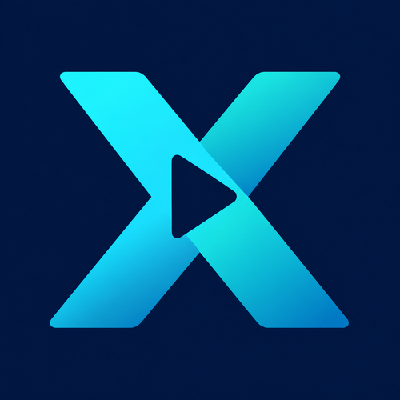

# XTV Android TV

<div align="center">
  
</div>

这是 XTV 的 Android TV 壳工程，支持系统 WebView 和 GeckoView 两种浏览器内核，用于打开 XTV 的 `/tv` 电视端页面。

默认桌面名称为 `XTV TV`。启动器、圆形图标入口和 TV 横幅使用与网页、PWA 一致的 XTV 标识。

## 构建参数

- `BASE_URL`: 服务端 Base URL，不需要带 `/tv`，例如 `https://example.com` 或 `http://192.168.1.10:3000`
- `APP_NAME`: Android TV 桌面显示名称，默认 `XTV TV`
- `VERSION_NAME`: APK 版本名
- `VERSION_CODE`: APK 版本号，整数
- `MIN_SDK`: 最低 Android API，标准版为 `23`（Android 6+），兼容版为 `21`（Android 5+）
- `GECKOVIEW_VERSION`: GeckoView 依赖版本，仅 GeckoView 版本使用，默认 `126.0.20240526221752`

App 启动时会自动打开：

```text
BASE_URL 去掉末尾 / 后 + /tv
```

`BASE_URL` 必须能从电视访问。项目的本地 Compose 默认只绑定电脑的 `127.0.0.1:3000`，需配置可达的反向代理地址或调整端口绑定及防火墙后再供电视使用；电视中的 `localhost` 指向电视自身。

## 特性

- GitHub Actions 默认构建四个版本：`webview-android6plus`、`webview-android5plus`、`geckoview-android6plus`、`geckoview-android5plus`
- GitHub Actions 未配置签名 secrets 时只构建 debug APK；配置完整签名 secrets 后只构建 release APK
- `webview` 版本使用系统 Android WebView，体积小但依赖设备内置 WebView 版本
- `gecko` 版本自带 GeckoView 浏览器内核，用于旧系统 WebView 无法兼容 Next.js 页面时测试
- 锁定横屏
- 支持 Android TV Launcher
- 允许 HTTP 明文访问
- 允许 HTTPS 页面加载 HTTP 视频/图片等混合内容
- 使用仓库根目录的 [public/logo.png](../../public/logo.png) 作为图标来源
- 内置局域网遥控服务，手机与电视在同一局域网时可打开遥控页面

## 图标与兼容性

Android 使用 [app/src/main/res/drawable/logo.png](app/src/main/res/drawable/logo.png) 作为图标资源。GitHub Actions 构建会从仓库根目录的 `public/logo.png` 自动复制；本地替换 Logo 后，也需同步该文件再构建 APK。

为兼容已有安装和网页遥控桥接，Android 包名、JavaScript 桥接标识及 User-Agent 标识沿用原值。`webview` 版本仍在 User-Agent 中追加 `MoonTVPlusAndroidTV WebView`，应用展示名称和图标统一使用 XTV。

## 本地构建

可使用与 GitHub Actions 一致的构建环境：JDK 17、Gradle 8.10.2、Android SDK Platform 35 和 Build Tools 35.0.0。仓库未包含 Gradle Wrapper，以下命令使用已安装的 `gradle`。

在 `apps/android-tv` 目录执行：

```bash
gradle assembleWebviewDebug -PBASE_URL="http://192.168.1.10:3000"
gradle assembleGeckoDebug -PBASE_URL="http://192.168.1.10:3000"
```
